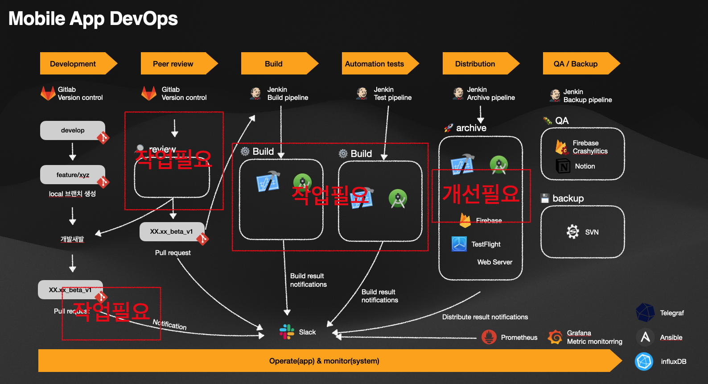

## devOps  

[imgGuru - devOps2024 board](https://www.igmguru.com/blog/best-devops-tools)

## list

| 파일명         | 내용          |
|----------------|---------------|
| docker-jenkins-backup.groovy      | docker 컨테이너 백업 파이프라인  |
| jenkins-monitoring-prometheus-grafana.md     | prometheus, grafana를 jenkins에 연동 |

## member
- lunight

rebase 테스트